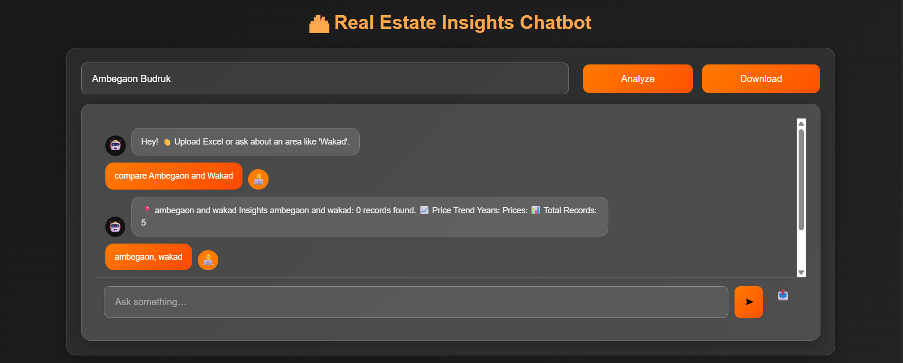
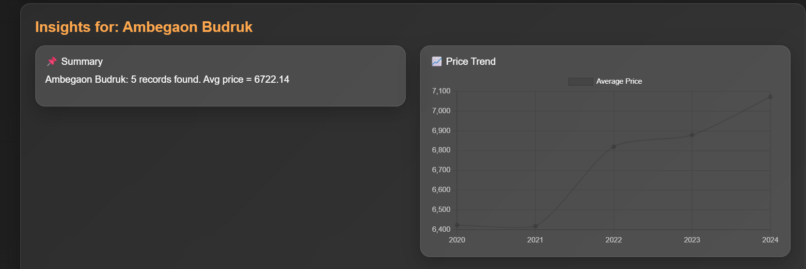
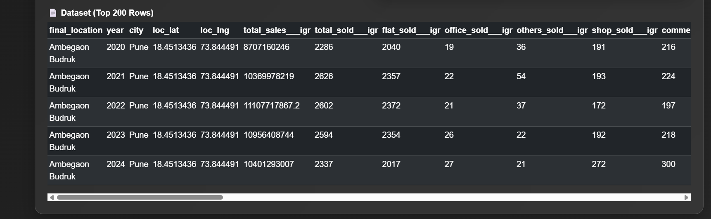

🏙 Real Estate Insights Chatbot
Full-Stack Locality Analysis (Django + React)

## Description
A powerful full-stack project that analyzes real-estate locality data, generates summaries (non-AI), shows price trends, displays datasets, and allows CSV download/upload.

⭐ Features
    🔍 Search locality (Ambegaon Budruk, Wakad, Aundh, Baner, etc.)
    🎯 Fuzzy matching for partial/misspelled names
    📌 Summary generation (dataset-based, NO AI)
    📈 Price trend visualization (year-wise chart)
    📄 Dataset table (Top 200 rows)
    ⬇️ Download filtered CSV
    ⬆️ Upload Excel dataset (.xlsx)
    ⚡ Modern UI using React + Bootstrap + Framer Motion

📁 Project Structure
realstate-chatbot/
│
├── backend/                  # Django backend API
│   ├── analysis/             # App (views, urls)
│   ├── realestate_backend/   # Django project settings
│   ├── requirements.txt
│   └── manage.py
│
├── frontend/                 # React frontend
│   ├── src/
│   └── package.json
│
├── screenshots/              # Images for README
│   ├── home.png
│   ├── analyze.png
│   └── data.png
│
└── README.md

⚙️Detailed Features
🔍 1. Advanced Locality Search

Supports:
    Correct names
    Partial names
    Misspelled names
    Multiple areas
📌 2. Data-Based Summary
Example:
    Ambegaon Budruk: 5 records found. Avg price = 6722.14
📈 3. Price Trend Chart
    Displays year-wise average price trend.
📄 4. Dataset Table
    Shows Top 200 results with all available columns.
⬇️ 5. Download CSV
    Exports filtered CSV instantly.
⬆️ 6. Upload Excel Dataset
    Upload .xlsx file → backend updates immediately.
⚡ 7. Smooth & Modern UI
    React + Bootstrap + Framer Motion animations.

🛠 Installation
    1. Clone the Repository
    git clone https://github.com/Somanikaushik43/realstate-chatbot.git
    cd realstate-chatbot

🐍 Backend Setup (Django)
1️⃣Create Virtual Environment
    cd backend
    python -m venv venv
2️⃣Activate (Windows)
    venv\Scripts\activate
3️⃣Install Dependencies
From project root:
    pip install -r requirements.txt
4️⃣Run Migrations:
    cd backend
    python manage.py migrate
5️⃣Run Server
    python manage.py runserver

Backend runs at:
👉http://127.0.0.1:8000/

📱 Frontend Setup (React)
1️⃣ Go to frontend folder
    cd frontend
2️⃣ Install Dependencies
    npm install
3️⃣ Start React App
    npm start

Frontend runs at:
👉http://localhost:3000/

🔌 API Endpoints (Non-AI)
1️⃣ Query Locality
    GET /api/query/?area=Wakad
2️⃣ Upload Excel
    POST /api/upload/
3️⃣ Download CSV
    GET /api/download/?area=Wakad
📸 Screenshots

🚀 Deployment
🌐Frontend (React)
    npm run build
Upload /build folder to:
    - Vercel
    - Netlify
    - GitHub Pages

🟦Backend(Django)
Deploy using:
    Render (recommended)
    Railway
    PythonAnywhere
    DigitalOcean

Make sure to set:
    DEBUG=False
    ALLOWED_HOSTS=['*']

🤝 Contributing
PRs are welcome!
Report issues or suggest improvements.

📜 License
MIT License.

🌟 Author
Built by Kaushik Somani
Using Django + React + Bootstrap + Framer Motion

